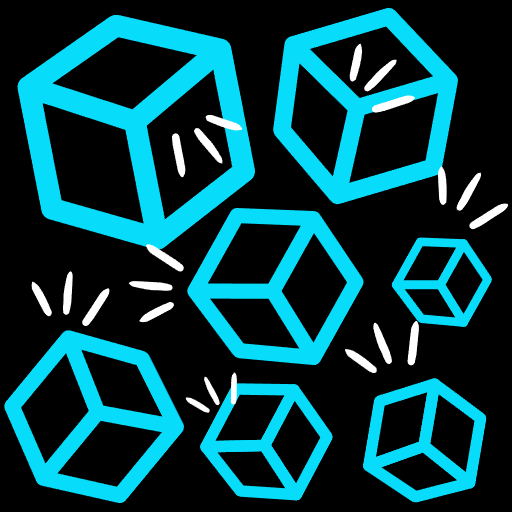

# Cube Crusher 3D

Cube Crusher 3D is an exciting and addictive Android game where your objective is to crush cubes and achieve the highest score possible. The game is designed to challenge your reflexes and strategic thinking, making it a perfect choice for players of all ages.

## Features

- Simple and intuitive gameplay: Tap on the cubes to crush them before they reach the top.
- Colorful and vibrant 3D graphics: Immerse yourself in a visually appealing gaming experience.
- High score tracking: Compete with your friends and players worldwide to see who can get the highest score.

## Installation

To play Cube Crusher 3D on your Android device, follow these steps:

1. Download the APK file from the [Releases](app/release/) section.
2. Enable installation from unknown sources in your device settings.
3. Install the APK file on your device.
4. Open the game, and you're ready to start crushing cubes!

## How to Play

1. Launch the game and tap "Play" to start.
2. The cubes will start moving upwards; tap on them to crush and destroy them.
3. Crush as many cubes as you can to earn points and increase your score.
4. Be quick and attentive; missing cubes will cost you lose.
5. The game ends when a single cube is missed.

## License

Cube Crusher 3D is released under the [MIT License](./LICENSE).

## Warning
Unauthorized use, reproduction, or distribution of this code, in whole or in part, without the explicit permission of the owner, is strictly prohibited and may result in severe legal consequences under the relevant IT Act and other applicable laws.
To use this code, you must first obtain written permission from the owner. For inquiries regarding licensing, collaboration, or any other use of the code, please contact virendratarte22@gmail.com.
Thank you for respecting the intellectual property rights of the owner.

